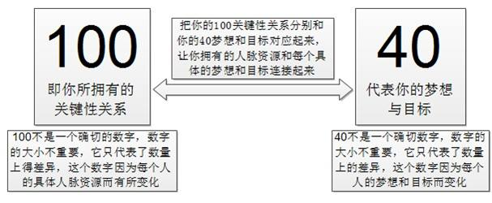

# 人脉，关键性关系的力量

## 核心思想

人的精力有限 --> 将精力花在刀刃上 --> 运用100关键性关系 --> 实现40梦想与目标

如下图所示：

“关键性关系”优于“个人经历”

## 100个关系够吗？

首先，100/40法则中的100和40，并不代表具体的数量，只是表明了数量上的差异，可以是50，也可以是200。

另外，花太多时间维护数量庞大无意义的关系，不如集中精力维护好100关系。

100关系对应的人，也有其自己的100关系，利用好关键性关系网，就可以得到100乘100的关键性关系（加法变乘法）。

## 你的梦想和目标还在吗？

确认一下，你是否：

* 做着喜欢做的事情
* 和喜欢的人在一起
* 居住在喜欢的地方
* 你的家人也喜欢
* 这一切都符合情理

是时候重新定义一下人生目标了，找到自己喜欢的东西。

来个荒野之旅，然后问问自己，梦想是什么？是否有足够的能力和竞争力实现梦想？是否已经得到了想要的生活？

做不喜欢的事，会让你老得更快；做喜欢的事，会让你保持年轻，精力充沛，身体健康。

## 展示你的梦想壁

将你的梦想列在梦想壁，可以让你：

* 找到方向感
* 找到要联系的人

## 该联系谁呢？

首先，你需要理清你的“关键性关系”世界。

### 内部社交圈

* 1个至交，甚至超越了亲人
* 3个亲密伙伴，敞开心扉，无所不谈
* 12个朋友，无条件爱你，支持你，帮助你，相互承认关系，宁可睡在你家的沙发上

### 关键性关系

和内部社交圈唯一的差别是，接近度，机会多少及时间长短。

区分：打电话，是因为真的在乎他吗？

内部社交圈和关键性关系，才是你要花精力去维护的关系。

### 盟友

通过内部和关键性关系接触认识的人。

会在你不经意的时候帮助到你。

### 拥护者

你不认识，但认识并支持你的人。

### 熟人

只有有限的认识，亲密度远低于朋友。

但，朋友都始于熟人。

### 粉丝

经济的车轮~

**整理你的内部社交圈和关键性关系，然后联络他们吧。**

## 如何建立和维护你的关键性关系？

记住，你已经认识了你需要认识的每一个人，你要做的只是：回忆 --> 伸手 --> 再联系

基于相互尊重及共同的兴趣爱好，可以帮助建立关系。

记住，别人何时成为你的“时刻创造者”；努力成为，别人的“时刻创造者”

周围的人决定了你的高度，你的高度决定了能吸引哪些周围的人。

**成功人士的重要品质：**立即行动，不怕阻碍，不怕失败，保持自律，坚持到底。

**获得人脉的方法：**积极的心态，吸引力法则，价值观和情感是很好的纽带，找到有连接点能力的人，形象塑造，互惠原理，打造自己核心价值，获得信任。

## 为什么“关键性关系”优于“个人经历”？

80%的职位空缺不打广告，而是靠关键性关系推荐。关键在于：你认识谁，谁认识你。

这个世界不是自己在单打独斗，只有合作才能创造更大的价值

## 注意

不要以为某个人的出现，让你瞬间实现梦想。你需要，主动出击，列出计划书，一步一步迈进

没有一蹴而就的成就，而是逐步演化。去做 --> 积累经验，人脉 --> 发现机会/商机 --> 联合朋友，亲人，团队 --> 更大的发展

不是随便找人帮忙，而是找你的关键性朋友
